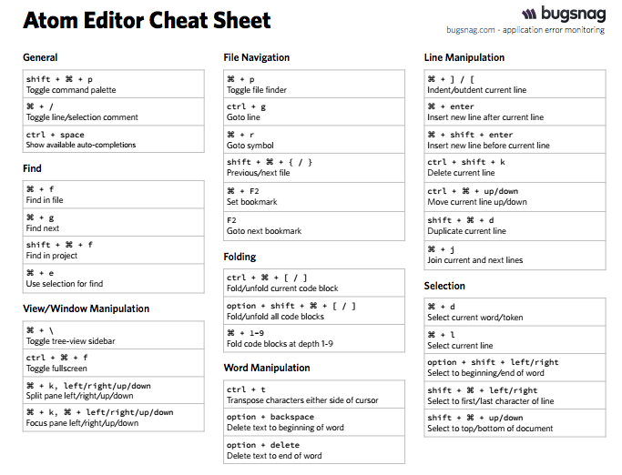

# Keyboard Shortcuts

### Basic Mac Shortcuts
#### These key combos work in most Mac applications

- **Command  Space** → this will bring up your Spotlight.
Use this to launch your Terminal, PostgreSQL, or any other application installed on your Mac

- Hold down **Command** and tap **Tab** to switch between open applications
- Hold down **Command** and tap **~** to switch between different windows of the same application. This can be helpful when you have many Atom or Chrome windows open.

- **Command  S**  -  Save current document
- **Command  Option  S** -  Save all open documents
- **Command  A**  -  Select all in current document
- **Command  C**  -  Copy
- **Command  X**  - Cut
- **Command  V**  - Paste
- **Command  F**  - bring up a text box to find/search for specific text in the current window

- **Option** and tap  **←** or **→**  -  Move to the end or beginning of a word.
- **Command** and tap  **←** or **→**  -  Move to the end or beginning of a line
- **Shift** and tap **←** or **→**  - Highlights by letter
- **Shift Option** and tap **←** or **→**  - Highlights by word
- **Shift Command** and tap **←** or **→**  - Highlights to the start or end of the line.  Tap the arrow key once more if you were just looking to move the curser

<a href="https://support.apple.com/en-us/HT201236">Full list of Mac keyboard shortcuts</a>

### Basic Atom Shortcuts (many of these work in other text editors as well)

- **Command /** -  Turn the selected text into a comment, or uncomment the text if already a comment
- **Command** and tap  **←** or **→**  -  Move to the end or begining of a line
- **Command  Delete** -  Delete to beginning of line
- **Command  D**  -  Select next instance of highlighted text
- **Command  Control  G**  -  select all instances of highlighted text
- **Command  Control** and tap **↑** or **↓** -  move line up//down
- Hold down **Command** and click multiple locations to use multiple simultaneous cursors

****

### ShiftIt Basics (window management)

- **Control  Option  Command** + **←** or **→**  - Snaps the active widow to the right or left of your screen.  Tap **←** or **→** again to reduce the % of the screen occupied by the window
- **Control  Option  Command** + **↑** or **↓**  - Same as above, but snaps to the top or bottom
- **Control  Option  Command  M**  -  Brings the active window to fullscreen (windowed)

#### Misc.

- Try typing the first few letters of a file or directory in your terminal and then press **Tab**.  Terminal will autocomplete the file/dir name
- Double-Clicking a word will highlight it
